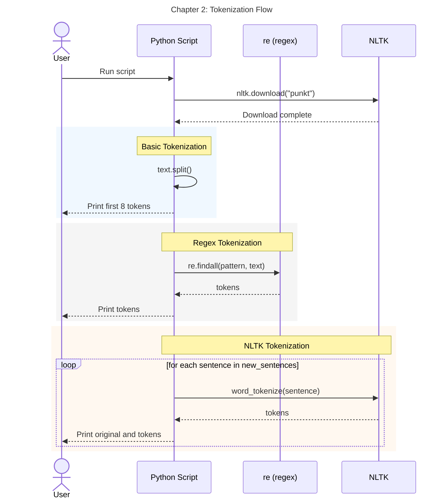

```mermaid
sequenceDiagram
    title Chapter 2: Tokenization Flow

    actor User
    participant Script as Python Script
    participant Regex as re (regex)
    participant NLTK

    User->>Script: Run script

    Script->>NLTK: nltk.download("punkt")
    NLTK-->>Script: Download complete

    rect rgb(240, 248, 255)
        Note over Script: Basic Tokenization
        Script->>Script: text.split()
        Script-->>User: Print first 8 tokens
    end

    rect rgb(245, 245, 245)
        Note over Script, Regex: Regex Tokenization
        Script->>Regex: re.findall(pattern, text)
        Regex-->>Script: tokens
        Script-->>User: Print tokens
    end

    rect rgb(255, 248, 240)
        Note over Script, NLTK: NLTK Tokenization
        loop for each sentence in new_sentences
            Script->>NLTK: word_tokenize(sentence)
            NLTK-->>Script: tokens
            Script-->>User: Print original and tokens
        end
    end
```
